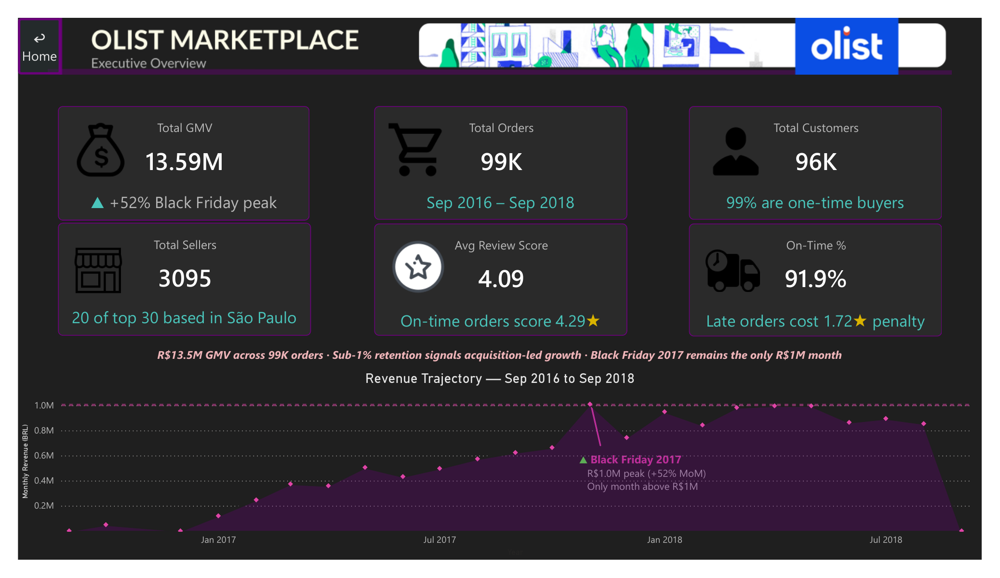
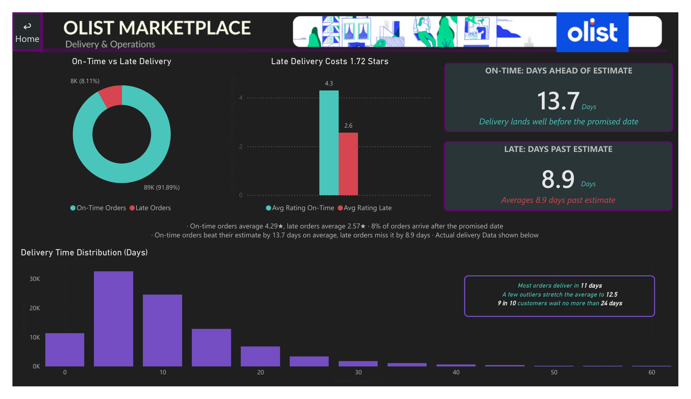

# Olist Marketplace Analytics

**End-to-end product analytics on Brazil's largest e-commerce marketplace — advanced SQL · Portuguese NLP · executive Power BI dashboard.**


> Three analytical layers built on one dataset: 15 advanced SQL queries across 99,441 orders, a Portuguese NLP pipeline scoring 42,370 free-text reviews with a negation-aware reason classifier, and a 9-page executive Power BI dashboard that ties operational quality directly to the voice of the customer. All revenue figures are in BRL.

---

## 🖼️ Dashboard Preview

**The headline finding the whole dashboard builds toward:** delivery is Olist's single biggest controllable lever. Late orders cost **1.72 stars**, are **3× more likely** to read negative in written text, and account for **one-third of all negative review reasons** — three independent analytical methods pointing at the same lever.

### Executive Overview


### Delivery & Operations — the 1.72★ penalty


### Voice of Customer — what customers actually say


> All 9 dashboard pages are in [`powerbi/screenshots/`](powerbi/screenshots/): Home · Executive Overview · Seller Performance & Risk · Customer Retention · Delivery & Operations · Sentiment Analysis · Sentiment Trends & Categories · Voice of Customer · Payments & Affordability.

---

## 🏗️ Architecture

```
┌─────────────────────┐     LOAD DATA INFILE        ┌──────────────────────┐
│   Kaggle CSV Files  │  ─────────────────────────► │                      │
│   8 tables          │     pandas (reviews only)   │   MySQL 8.0          │
│   ~530K rows        │  ─────────────────────────► │   olist database     │
└─────────────────────┘                             │                      │
                                                    │  ┌───────────────┐   │
                                    SQLAlchemy      │  │ order_reviews │   │
                               ┌────────────────────┤  │ order_items   │   │
                               │                    │  │ orders        │   │
                               ▼                    │  │ customers     │   │
                    ┌──────────────────────┐        │  │ sellers ...   │   │
                    │  Python NLP Pipeline │        │  └───────────────┘   │
                    │                      │ UPSERT │                      │
                    │  sentiment_analysis  ├───────►│  review_sentiment    │
                    │  BerTweet-PT model   │        │  review_reason       │
                    │  42,370 reviews      │        │  _summary            │
                    │                      │        └──────────────────────┘
                    │  reason_analysis_v2  │                  │
                    │  negation-aware      │          CREATE VIEW
                    │  rule classifier     │                  │
                    └──────────────────────┘                  ▼
                                                  ┌───────────────────────┐
                                                  │  SQL Analytical Views │
                                                  │  cohort_retention_    │
                                                  │  matrix               │
                                                  │  payments_by_state    │
                                                  │  review_reason_       │
                                                  │  summary              │
                                                  └──────────┬────────────┘
                                                             │  Import Mode
                                                             ▼
                                                  ┌───────────────────────┐
                                                  │  Power BI Desktop     │
                                                  │  9-page Dashboard     │
                                                  │  Star Schema · DAX    │
                                                  │  Custom Design System │
                                                  └───────────────────────┘
```

---

## 📌 Business Context

Olist is Brazil's largest e-commerce marketplace, connecting 3,095 sellers to customers across all 27 Brazilian states. This project answers the questions a marketplace analytics team deals with every week: which sellers drive the most revenue and carry the most platform risk, whether Olist has a retention problem or an acquisition problem, how operational quality (delivery SLA) translates into review scores — and, one layer deeper, what customers are *actually saying* in their own words and whether that text agrees with the star rating they clicked.

The dataset has embedded newlines in review text, Portuguese category names requiring translation joins, and NULL delivery timestamps for cancelled orders — the kind of data quality issues that don't exist in tutorial datasets but appear in every production database.

**Scale:** 8 tables · 99,441 orders · ~530K rows · R$13.5M GMV · Sep 2016 – Sep 2018 · 42,370 NLP-scored reviews

---

## 🎯 North Star Metric

**Qualified GMV** — Revenue from orders that are *both* delivered on time *and* received a review score of ≥ 4 stars.

**Why this metric, not total GMV:**
Total GMV hides the fact that 8.1% of Olist's orders arrive late and average 2.57 stars — orders that generate revenue in the short term while destroying platform reputation and repeat purchase intent in the long term. Qualified GMV makes quality a first-class business metric rather than an operations dashboard afterthought.

**Current baseline (from dataset):**
- Total GMV: R$13,496,408
- On-time + ≥ 4★ share: ~83% of orders
- Late-delivery "toxic revenue": ~R$1.1M — income that costs more in NPS than it earns in margin

---

## ❓ Business Questions Answered

| # | Question | SQL File | Finding |
|---|---|---|---|
| 1 | Which sellers dominate each category — and what does the revenue gap signal? | `top_sellers_by_category.sql` | `bed_bath_table` has 3× concentration risk |
| 2 | Where does demand actually live? | `top_cities_by_state.sql` | DF shows extreme one-city concentration |
| 3 | How did Olist grow from first order to R$13.5M GMV? | `revenue_running_total.sql` | Three distinct phases; plateau from Apr 2018 |
| 4 | Does Olist have a retention problem or an acquisition problem? | `cohort_retention.sql` | Sub-1% m1 retention — structural one-time buyer |
| 5 | Who are the most loyal customers, and how loyal are they really? | `customer_order_streaks.sql` | Only 11 of 96K customers ordered 3+ consecutive months |
| 6 | What is the true cost of a late delivery in review stars? | `delivery_sla_review_impact.sql` | **1.72 star penalty** — 4.29 on-time vs 2.57 late |
| 7 | How do payment preferences vary across income regions? | `payment_behaviour_by_state.sql` | Boleto peaks 29% in AP vs 20% in SP |
| 8 | Where is order value concentrated? | `order_value_percentiles.sql` | Top 10% of orders generate 38% of revenue |
| 9 | Which sellers balance revenue, delivery, and satisfaction? | `seller_scorecard.sql` | BA seller at rank 2 outperforms 20 SP sellers |
| 10 | **(NLP)** Where does written sentiment disagree with the star rating? | Python + Power BI | 435 diverging reviews — 328 are 5★ but read negative |
| 11 | **(NLP)** Why are reviews negative — in actionable terms? | `reason_analysis_v2.py` | 33.3% of negatives cite late/non-delivery |

---

## 🔑 Key Findings

### 1. Seller Concentration by Category

| Category | Rank 1 | Rank 2 | Rank 3 | Signal |
|---|---|---|---|---|
| watches_gifts | R$201K | R$192K | R$170K | Healthy — within 16% |
| health_beauty | R$79K | R$72K | R$66K | Healthy |
| bed_bath_table | R$165K | R$152K | R$55K | **Risk — 3× gap to rank 3** |
| computers_accessories | R$53K | R$52K | R$47K | Healthy — very tight |
| sports_leisure | R$54K | R$42K | R$42K | Moderate |

`bed_bath_table` is the flag: the top two sellers earn nearly 3× what rank 3 makes, giving them significant commission negotiation leverage over the platform.

### 2. Customer Retention — the one-time buyer problem

| Cohort | Acquired (m0) | Returned (m1) | m1 Retention |
|---|---|---|---|
| 2017-01 | 762 | 3 | 0.4% |
| 2017-05 | 3,571 | 17 | 0.5% |
| 2017-08 | 4,162 | 28 | 0.7% |
| 2017-11 (Black Friday) | 7,270 | 40 | **0.6%** |
| 2018-01 | 6,992 | 23 | 0.3% |

96.9% of Olist's 96,096 customers never placed a second order. Only 11 ordered in 3+ consecutive months. This is not a retention execution failure — it is the structural nature of the product category (furniture, electronics, home goods). The strategic implication: optimise for first-order margin and acquisition efficiency, not loyalty programs.

### 3. Delivery SLA — the 1.72 star penalty

| Status | Orders | % of Total | Avg Rating | Avg Days vs Estimate |
|---|---|---|---|---|
| On Time | 88,653 | 91.9% | **4.29 ⭐** | 13.7 days *ahead* of promise |
| Late | 7,700 | 8.1% | **2.57 ⭐** | 8.9 days *past* promise |

The −13.7 days for on-time orders is a deliberate platform strategy: Olist under-promises on delivery estimates and over-delivers. Customers expecting two weeks receive their order in under one — that surprise drives the 4.29 average. **Do not tighten delivery estimates. This is a zero-cost rating driver.**

### 4. Olist GMV Trajectory

| Milestone | Date | Value |
|---|---|---|
| First ever order | 2016-09-04 | R$72.89 |
| Platform inflection (single day) | 2016-10-04 | R$9,571 daily |
| Black Friday peak (monthly) | 2017-11 | R$1,003,862 |
| Revenue plateau begins | 2018-04 | ~R$990K/month |
| Total GMV (end of dataset) | 2018-09-03 | R$13,496,408 |

### 5. Order Value Distribution

| Percentile | Order Value | Notes |
|---|---|---|
| 25th | R$61 | Bottom quarter |
| 50th (median) | R$104 | Typical order |
| 75th | R$175 | Upper half |
| 90th | R$297 | High-value threshold |
| Top 10% decile | R$307+ | **Generates 38.1% of total revenue** |
| Maximum | R$13,664 | 130× the median |

### 6. Capstone Seller Scorecard

| Revenue Rank | State | Revenue | Late % | Avg Rating | Segment |
|---|---|---|---|---|---|
| 1 | SP | R$229K | 11.6% | 4.13 ⭐ | Standard |
| 2 | BA | R$223K | **4.3%** | 4.13 ⭐ | **Star Seller ✓** |
| 3 | SP | R$200K | 11.0% | 3.83 ⭐ | Standard |
| 4 | SP | R$194K | 10.2% | 4.34 ⭐ | Standard |
| 5 | SP | R$188K | 10.1% | 3.48 ⭐ | **High Revenue Risk ⚠** |

Rank 5 — R$188K in revenue at 3.35 stars — is a hidden platform risk. High revenue masks a quality failure. Without a multi-dimensional view, this seller looks like a success story. With it, they're a threat to platform NPS.

### 7. Payment Behaviour — Regional Affordability Signal

| State | Boleto % | Credit Card % | Avg Installments | Avg Order Value |
|---|---|---|---|---|
| AP | 28.6% | 67.1% | 2.6 | R$232 |
| RR | 28.3% | 71.7% | 2.7 | R$219 |
| MA | 26.5% | 69.8% | 3.1 | R$199 |
| SP | 19.7% | 77.1% | 2.6 | R$137 |

Boleto (the payment method of the unbanked) peaks in Brazil's poorest northern states. Higher-value purchases in lower-income regions are spread across more installments — the same product, made affordable through financing.

---

## 💡 Business Recommendations

| Recommendation | Data Source | Expected Impact |
|---|---|---|
| Treat delivery speed as the #1 CX investment | 33.3% of negatives cite late delivery; 1.72★ penalty | Every 1% reduction in late rate → measurable rating improvement |
| Stop investing in loyalty — maximise first-order margin | Sub-1% m1 retention across all cohorts | Reallocate retention budget to acquisition efficiency |
| Diversify `bed_bath_table` seller base | Top 2 sellers earn ~3× rank 3 | Reduce commission negotiation leverage risk |
| Fast-track exit review for High Revenue Risk sellers | Rank 5 seller: R$188K at 3.35★ | Protect platform NPS before it appears in aggregate |
| Maintain deliberate delivery under-promise policy | On-time orders arrive 13.7 days early → 4.29★ | Do not tighten estimates — this is a zero-cost rating driver |
| Audit 5★-but-negative reviews manually (328 cases) | Sentiment divergence analysis | Early-warning signal current QA pipeline misses entirely |

---

## 🧠 Sentiment Analysis — Portuguese NLP

The reviews table holds 1–5 star scores *and* free-text comments in Brazilian Portuguese. The star tells you *how many* customers were unhappy; the text tells you *why* — and sometimes they contradict each other.

**Model:** `pysentimiento/bertweet-pt-sentiment` — a RoBERTa trained natively on Brazilian Portuguese. It reads review text *independently* of the star score. That independence makes the divergence finding meaningful: a star-predicting model would be circular.

**Coverage:** 99,224 total reviews · 42,370 with comment text (42.7%) · 56,854 score-only (excluded)

| Sentiment | Reviews | Share |
|---|---|---|
| Positive | 21,359 | 50.4% |
| Neutral | 12,723 | 30.0% |
| Negative | 8,288 | 19.6% |

**Divergence — where sentiment and star rating disagree (435 cases):**

| Case | Count | Business meaning |
|---|---|---|
| 5★ rating but **negative** text | 328 | Hidden dissatisfaction — a QA blind spot |
| 1★ rating but **positive** text | 107 | Context reviews — low score driven by logistics, not product |

These 435 reviews are completely invisible to a star-only dashboard. They are the most actionable output of the NLP layer.

---

## 🗣️ Voice of Customer — Reason Classification

Sentiment answers *how many* customers were unhappy. The reason classifier answers *what to fix*. Raw keyword frequency surfaced only generic emotion words ("terrible", "loved it") with no actionable value. I built a **rule-based, multi-label, negation-aware classifier** that maps Portuguese review text to concrete business reasons.

**Negation handling is the key accuracy fix.** A naive keyword match counts *"não recomendo"* ("I do NOT recommend") as praise. The classifier checks the 3 words before any praise trigger for a negator (não/nem/nunca) and discards the match if negated — catching **326 false positives** and correcting "late delivery" false positives from 5,412 down to 454.

**Top reasons per sentiment:**

| Negative reviews (8,309) | Neutral reviews (12,416) | Positive reviews (20,233) |
|---|---|---|
| Late or non-delivery — **33.3%** | Late or non-delivery — 22.6% | Delighted / would recommend — **63.2%** |
| Wrong or incomplete item — 10.1% | Fast / early delivery — 11.9% | Fast / early delivery — 23.1% |
| Wants refund / cancellation — 10.0% | Wrong or incomplete item — 4.8% | Good product / as described — 14.0% |
| Damaged or defective — 8.0% | | |
| Poor quality / not as described — 6.0% | | |

**The thesis confirmed across three independent methods:** delivery appears as the dominant driver in the SQL analysis (1.72★ penalty), in the raw NLP (late orders 3× more likely to read negative), and in the reason classification (33.3% of negatives cite late/non-delivery). Three different analytical approaches, one answer.

---

## 📊 Executive Power BI Dashboard

A 9-page executive report built on a star/galaxy schema (fact grain = order line items), Import mode, with a custom dark design system and Home-page navigation.

| Page | Headline Insight |
|---|---|
| **00 Home** | Landing page — dataset summary and navigation to all 8 content pages |
| **01 Executive Overview** | KPI cards + GMV trajectory with Black Friday peak annotated on-chart |
| **02 Seller Performance & Risk** | 4-segment scorecard + `bed_bath_table` concentration + revenue-by-state map |
| **03 Customer Retention** | Sub-1% cohort retention heatmap across every cohort and month |
| **04 Delivery & Operations** | The 1.72★ late-delivery penalty + 13.7-day under-promise insight |
| **05 Sentiment Analysis** | Sentiment vs star-rating divergence matrix (435 cases) |
| **06 Sentiment Trends** | Sentiment stability over time + breakdown across top 10 categories |
| **07 Voice of Customer** | Reason classifier — why reviews are negative / neutral / positive |
| **08 Payments & Affordability** | Boleto-usage map + order-value-vs-installments scatter |

**Technical challenges solved (interview material):**
- **Many-to-many filter leakage** between `fact_order_items` and `fact_reviews` — fixed via explicit `TREATAS()` joins and `Edit Interactions` where DAX's relationship engine leaked filters through unintended paths
- **Cross-filter contamination on derived percentage measures** — resolved by moving complex aggregations into precomputed SQL views rather than fighting the CALCULATE/ALL() context further

---

## 🧪 Experiment Ideas

Based on the data findings, here are three high-ROI experiments Olist could run:

**Experiment 1 — Proactive Delay Notification**
*Hypothesis:* Customers who receive a proactive SMS/email when their order is running late will rate the experience significantly higher than those who discover the delay themselves.
*Baseline:* Late orders currently average 2.57 stars. Even a 0.5★ improvement on 7,700 late orders would materially shift the platform average.
*Measurement:* A/B test on late orders — control (no notification) vs treatment (proactive notification). Primary metric: review score of late-delivery orders.

**Experiment 2 — First Re-Order Coupon at Day 30**
*Hypothesis:* A time-limited discount coupon sent 30 days after first purchase will measurably improve m1 retention.
*Baseline:* Current m1 retention is sub-1% across all cohorts.
*Caveat from data:* At 0.4–0.7% retention, even doubling it (to ~1%) may not justify the coupon cost. The experiment tests whether the product category is the blocker or if reactivation messaging can move the needle at all.

**Experiment 3 — Star Seller Badge on Product Listing**
*Hypothesis:* Surfacing seller quality (Star Seller badge) on product listing pages will shift order share toward high-quality sellers and improve platform-average review scores.
*Baseline:* Current Star Sellers (≥4.0★, ≤10% late) represent a minority of sellers but a disproportionate share of quality orders.
*Measurement:* Conversion rate and avg review score of orders from badged vs non-badged listings in the same category.

---

## 🗒️ A Note on This Project

I spent a few weeks on this — not because Olist is a glamorous dataset, but because the questions it raises are exactly the kind a product analyst handles in a real marketplace: which sellers are risks vs. assets, whether the platform has a retention problem or an acquisition problem, and what customers actually think vs. what their star rating suggests.

The SQL goes beyond the basics — every query answers a specific business question, not just "show me the data." The NLP layer came out of frustration with raw keyword frequency surfacing useless words like "terrible" with no business value. The Power BI dashboard was reworked after filter context leakage broke two pages simultaneously.

If you want to evaluate specific depth: `seller_scorecard.sql` for SQL, `sentiment_analysis.py` for the Python pipeline, and the Customer Retention page in the dashboard for product thinking.

---

## 🛠️ Tools & Technologies

| Tool | Version | Purpose |
|---|---|---|
| MySQL | 8.0 | Data storage, all SQL analysis, analytical views |
| Python — pandas, SQLAlchemy | 2.x | Data loading + reason classification |
| Python — pysentimiento, transformers, PyTorch (CPU) | latest | Portuguese NLP sentiment pipeline on 42,370 reviews |
| Power BI Desktop | latest | 9-page executive dashboard — star schema, DAX, custom design system |
| Git + GitHub | — | Version control and portfolio hosting |

---

## 📁 Project Structure

```
olist-marketplace-analytics/
│
├── sql/                                            ← All SQL work (see sql/README.md)
│   ├── 01_setup/
│   │   ├── 01_create_tables.sql                   ← Schema + FKs + performance indexes
│   │   └── 02_load_data.sql                       ← Bulk load for 7 tables
│   │
│   ├── 02_findings/                               ← 13 analytical queries, one business question each
│   │   ├── top_sellers_by_category.sql
│   │   ├── top_cities_by_state.sql
│   │   ├── revenue_running_total.sql
│   │   ├── category_orders_running_total.sql
│   │   ├── monthly_revenue_growth.sql
│   │   ├── category_mom_order_growth.sql
│   │   ├── cohort_retention.sql
│   │   ├── customer_order_streaks.sql
│   │   ├── sellers_above_state_avg_rating.sql
│   │   ├── delivery_sla_review_impact.sql
│   │   ├── payment_behaviour_by_state.sql
│   │   ├── order_value_percentiles.sql
│   │   └── seller_scorecard.sql                   ← Capstone — 5 tables, 4 CTEs, 3 ranking dimensions
│   │
│   ├── 03_sentiment/
│   │   └── 01_create_review_sentiment.sql         ← NLP output table schema
│   │
│   └── 04_views/                                  ← Materialised views feeding Power BI
│       ├── 01_cohort_retention_matrix.sql
│       ├── 02_payments_by_state.sql
│       └── 03_review_reason_summary.sql
│
├── python/                                        ← NLP pipeline (see python/README.md)
│   ├── load_reviews.py                            ← pandas loader — bypasses LOAD DATA INFILE
│   ├── sentiment_analysis.py                      ← BerTweet-PT pipeline, idempotent UPSERT
│   ├── reason_analysis_v2.py                      ← Negation-aware reason classifier
│   └── requirements.txt                           ← Pinned dependencies
│
├── powerbi/                                       ← Dashboard (see powerbi/README.md)
│   ├── olist_marketplace_analytics.pbix           ← Full 9-page Power BI file
│   ├── screenshots/                               ← PNG export of all 9 pages
│   ├── Banners/                                   ← Page header banner images
│   ├── Icons/                                     ← KPI card icon set
│   └── Theme work/                                ← Custom JSON theme files
│
├── docs/                                          ← Business documentation
│   ├── business_case.md                           ← Detailed write-up of all 12 findings
│   └── olist_data_model.svg                       ← Star schema diagram
│
├── data/                                          ← Not tracked (see data/README.md)
│   └── *.csv                                      ← Download from Kaggle (link below)
│
├── LICENSE                                        ← MIT
└── README.md                                      ← This file
```

---

## 📊 SQL Techniques Demonstrated

| Technique | Where Used |
|---|---|
| `ROW_NUMBER()` with `PARTITION BY` | Top-N sellers per category; top cities per state |
| `LAG()` with `PARTITION BY` | MoM revenue growth; MoM order growth per category |
| `ROWS BETWEEN UNBOUNDED PRECEDING AND CURRENT ROW` | Cumulative GMV running total |
| `ROWS BETWEEN 6 PRECEDING AND CURRENT ROW` | 7-day moving average on daily revenue |
| 5-stage CTE cohort logic | Monthly retention pivot — cohort → offset → active count → % |
| Gaps & Islands (row_number subtraction) | Consecutive ordering streak detection |
| `AVG() OVER PARTITION BY` | State-level seller benchmark comparisons |
| `NTILE(100)` | Order value percentile distribution |
| `NTILE(10)` | Revenue concentration by decile |
| Conditional aggregation pivot | Payment method mix across 27 states |
| Multi-CTE + `RANK()` + `CASE WHEN` | Capstone scorecard — 3 dimensions ranked simultaneously |
| `DATEDIFF` + NULL handling | Delivery SLA compliance — late vs on-time classification |
| `PERIOD_DIFF` | Month offset calculation for cohort analysis |
| `CREATE OR REPLACE VIEW` | Persisted analytical layer feeding Power BI directly |
| Performance indexes | Documented design rationale for every index added |

---

## 🔧 Data Quality Notes

**1. The reviews CSV breaks bulk loading.** `LOAD DATA INFILE` fails at row 77,917 because customer review text contains embedded newlines and imperfectly escaped quotes. MySQL's line parser trips on them. The fix is pandas — a proper CSV parser that handles multi-line quoted fields natively. The other 7 tables load fine via bulk load.

**2. Category names loaded with trailing carriage return characters.** Windows CRLF line endings in `product_category_name_translation.csv` left `\r` on every English category name — silently breaking every JOIN on that column with no error, just missing data. A single `UPDATE` with `REPLACE()` cleaned it.

**3. Duplicate `review_id` rows in the order-items join.** Joining reviews through `order_items` produced 437 duplicated divergence cases; deduplicating on `review_id` in Power Query corrected this to the true figure of **435**.

**4. `customer_id` vs `customer_unique_id`.** Using `customer_id` for cohort analysis makes every order appear to come from a new customer — producing near-zero retention for the wrong reason. `customer_unique_id` is the true person identifier in the Olist dataset. All cohort and retention queries in this project join on `customer_unique_id`.

**5. `order_reviews` has no FK to `orders` by design.** The dataset contains review rows for cancelled orders that have no matching delivered order. Enforcing a FK would silently reject those rows. The composite PK `(review_id, order_id)` is sufficient for referential integrity within the analysis scope.

---

## 📈 Dataset

**Source:** [Brazilian E-Commerce Public Dataset by Olist](https://www.kaggle.com/datasets/olistbr/brazilian-ecommerce) (Kaggle) · **Database:** MySQL 8.0

| Table | Rows | Contents |
|---|---|---|
| orders | 99,441 | The spine — status + 5 timestamps from purchase to delivery |
| order_items | 112,650 | Line items — price, freight, which seller fulfilled it |
| order_payments | 103,886 | Payment type, installments, value |
| order_reviews | 99,224 | 1–5 scores + free-text comments in Brazilian Portuguese |
| customers | 99,441 | City, state — no PII |
| products | 32,951 | Category, physical dimensions |
| sellers | 3,095 | City, state |
| category_translation | 71 | Portuguese → English category names |

---

## 🔁 Reproduce From Scratch

```powershell
# 1. Clone and enter the repo
git clone https://github.com/Brijesh403/olist-marketplace-analytics.git
cd olist-marketplace-analytics

# 2. Download the dataset from Kaggle into data/
#    https://www.kaggle.com/datasets/olistbr/brazilian-ecommerce

# 3. Set up the MySQL schema
#    Run sql/01_setup/01_create_tables.sql then sql/01_setup/02_load_data.sql in MySQL Workbench

# 4. Install Python CPU PyTorch (must be done before requirements.txt)
pip install torch --index-url https://download.pytorch.org/whl/cpu

# 5. Install remaining Python dependencies
pip install -r python/requirements.txt

# 6. Set database credentials (PowerShell)
$env:OLIST_DB_PASSWORD = "your_password"
$env:OLIST_DB_USER     = "root"           # optional, defaults to root

# 7. Load the reviews table (pandas handles embedded newlines)
python python/load_reviews.py

# 8. Run the Portuguese sentiment pipeline (resumable if interrupted)
python python/sentiment_analysis.py

# 9. Run the negation-aware reason classifier
python python/reason_analysis_v2.py

# 10. Create the analytical views for Power BI
#     Run sql/04_views/ files in order in MySQL Workbench

# 11. Open powerbi/olist_marketplace_analytics.pbix
#     Data source → change MySQL connection to your local instance → Refresh
```

---

**Brijesh Vaghela** · [LinkedIn](https://www.linkedin.com/in/brijesh-vaghela) · [GitHub](https://github.com/Brijesh403)
